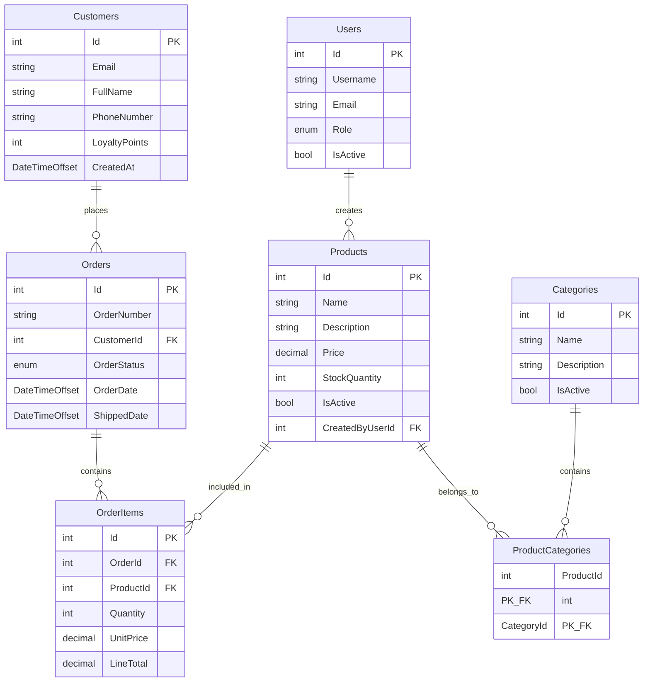

# TechMartDb

Database models for the TechMart e-commerce fictional company.

## Overview

This project contains the entity models for a simplified e-commerce database with products, sales (orders), customers, and users (employees/staff). The models demonstrate various relationship patterns and data types commonly used in real-world applications.

## Models

### Enums

#### UserRole
- Admin
- Manager
- Sales
- Support

#### OrderStatus
- Pending
- Processing
- Shipped
- Delivered
- Cancelled

### Entity Models

#### User
Represents employees/staff who manage the system.

| Property | Type | Description |
|----------|------|-------------|
| **Id** | int | Primary key |
| **Username** | string | Login username |
| **Email** | string | Employee email |
| **Role** | UserRole | Employee role (Admin, Manager, Sales, Support) |
| **IsActive** | bool | Account status |
| **CreatedProducts** | ICollection\<Product\> | Navigation: Products created by this user |

#### Customer
Represents customers who purchase products.

| Property | Type | Description |
|----------|------|-------------|
| **Id** | int | Primary key |
| **Email** | string | Customer email |
| **FullName** | string | Customer name |
| **PhoneNumber** | string? | Contact phone (nullable) |
| **LoyaltyPoints** | int | Accumulated loyalty points |
| **CreatedAt** | DateTimeOffset | Account creation date |
| **Orders** | ICollection\<Order\> | Navigation: Orders placed by this customer |

#### Category
Product categories for organization.

| Property | Type | Description |
|----------|------|-------------|
| **Id** | int | Primary key |
| **Name** | string | Category name |
| **Description** | string? | Category description (nullable) |
| **IsActive** | bool | Visibility status |
| **ProductCategories** | ICollection\<ProductCategory\> | Navigation: Junction table entries |

#### Product
Products available for sale.

| Property | Type | Description |
|----------|------|-------------|
| **Id** | int | Primary key |
| **Name** | string | Product name |
| **Description** | string? | Product description (nullable) |
| **Price** | decimal | Current price |
| **StockQuantity** | int | Available inventory |
| **IsActive** | bool | Product availability |
| **CreatedByUserId** | int | Foreign key to User |
| **CreatedByUser** | User | Navigation: User who created this product |
| **ProductCategories** | ICollection\<ProductCategory\> | Navigation: Categories this product belongs to |
| **OrderItems** | ICollection\<OrderItem\> | Navigation: Order items containing this product |

#### ProductCategory
Junction table for many-to-many relationship between Products and Categories.

| Property | Type | Description |
|----------|------|-------------|
| **ProductId** | int | Foreign key to Product (composite primary key) |
| **CategoryId** | int | Foreign key to Category (composite primary key) |
| **Product** | Product | Navigation: Referenced product |
| **Category** | Category | Navigation: Referenced category |

#### Order
Customer orders (sales transactions).

| Property | Type | Description |
|----------|------|-------------|
| **Id** | int | Primary key |
| **OrderNumber** | string | Human-readable order number |
| **CustomerId** | int | Foreign key to Customer |
| **OrderStatus** | OrderStatus | Order status (Pending, Processing, Shipped, Delivered, Cancelled) |
| **OrderDate** | DateTimeOffset | Order placement time |
| **ShippedDate** | DateTimeOffset? | Shipment date (nullable) |
| **Customer** | Customer | Navigation: Customer who placed this order |
| **OrderItems** | ICollection\<OrderItem\> | Navigation: Items in this order |

#### OrderItem
Individual items within an order.

| Property | Type | Description |
|----------|------|-------------|
| **Id** | int | Primary key |
| **OrderId** | int | Foreign key to Order |
| **ProductId** | int | Foreign key to Product |
| **Quantity** | int | Quantity ordered |
| **UnitPrice** | decimal | Price per unit (snapshot at time of order) |
| **LineTotal** | decimal | Total for this line (Quantity × UnitPrice) |
| **Order** | Order | Navigation: Parent order |
| **Product** | Product | Navigation: Product ordered |

## Relationships

### One-to-Many
- **Customer → Orders**: One customer can place multiple orders
- **Order → OrderItems**: One order contains multiple items
- **Product → OrderItems**: One product can appear in multiple order items
- **User → Products** (CreatedBy): One user can create multiple products

### Many-to-One
- **Order → Customer**: Many orders belong to one customer
- **OrderItem → Order**: Many items belong to one order
- **OrderItem → Product**: Many order items reference one product
- **Product → User** (CreatedBy): Many products created by one user

### Many-to-Many
- **Products ↔ Categories**: Via ProductCategory junction table
  - One product can belong to multiple categories
  - One category can contain multiple products

## Data Types

The models demonstrate various data types commonly used in .NET applications:

- **int**: Primary keys, foreign keys, quantities, loyalty points
- **string**: Names, emails, descriptions (with nullable reference types)
- **decimal**: Prices and monetary amounts
- **DateTimeOffset**: Timestamps with timezone information
- **DateTimeOffset?**: Nullable timestamps (e.g., ShippedDate)
- **bool**: Status flags and indicators
- **enum**: Predefined value sets (UserRole, OrderStatus)
- **ICollection\<T\>**: Navigation properties for related entities

## Entity Relationship Diagram

## Key Features

1. **Simple Structure**: Each table has only essential fields plus ID and foreign keys
2. **Diverse Data Types**: Includes int, string, decimal, DateTimeOffset, bool, and enum
3. **Clear Relationships**: 
   - One-to-Many: Customer→Orders, Order→OrderItems, Product→OrderItems, User→Products
   - Many-to-One: Reverse of above
   - Many-to-Many: Products↔Categories via junction table
4. **Practical Design**: Supports real e-commerce scenarios while remaining simple
5. **Data Integrity**: Foreign keys and navigation properties ensure referential integrity
6. **Modern .NET Features**: Uses nullable reference types and DateTimeOffset for timezone-aware timestamps

## Project Configuration

- **Target Framework**: .NET Standard 2.0
- **Nullable Reference Types**: Enabled
- **Implicit Usings**: Enabled
- **Language Version**: Latest
- **No ORM Dependencies**: Pure POCO models (can be used with any ORM)

## Usage

These models can be used with Entity Framework Core or any other ORM. The project includes seed data in [`SeedData.cs`](SeedData.cs) for testing and development purposes.
